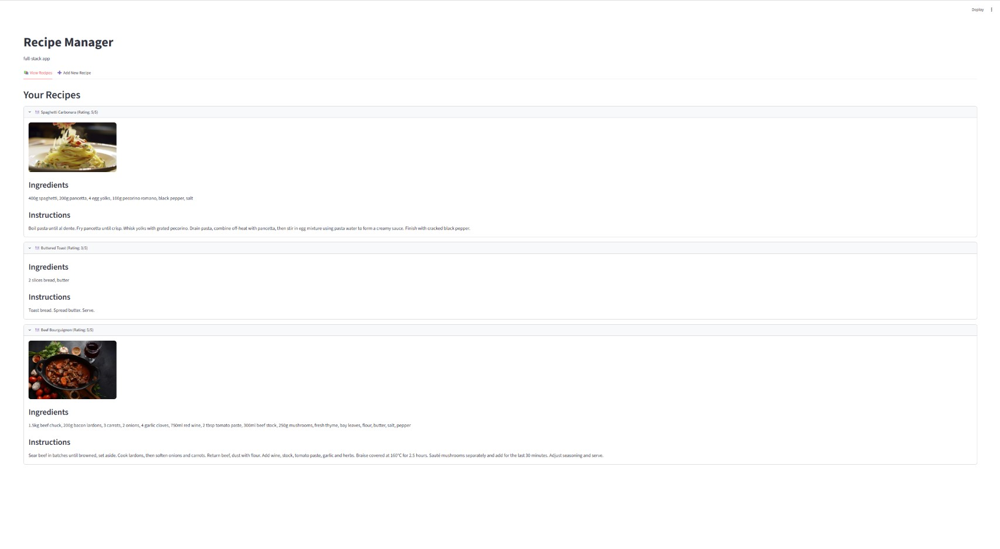

# Recipe Manager

A full-stack recipe management application built with a **FastAPI** REST backend and a **Streamlit** frontend. Users can create, view, edit, and delete recipes, and upload a photo for each one through a security-hardened upload endpoint.



## Features

- Full CRUD for recipes (create, read, update, delete) via a REST API
- Secure image upload with layered validation
- Search-friendly, paginated recipe listing
- Auto-generated interactive API docs (Swagger UI)
- Clean, layered architecture (API / services / models / schemas)

## Tech Stack

| Layer    | Technology                          |
|----------|-------------------------------------|
| Backend  | FastAPI, SQLAlchemy, Pydantic v2    |
| Database | SQLite                              |
| Frontend | Streamlit                           |
| Other    | Pillow (image validation), Uvicorn  |

## Architecture

The backend follows a layered design that separates concerns:
app/

├── api/         # HTTP routes (endpoints)

├── core/        # Database engine and session management

├── models/      # SQLAlchemy ORM models

├── schemas/     # Pydantic request/response validation

├── services/    # Business logic / database operations (CRUD)

└── main.py      # App entry point, router + static file mounting

frontend/

└── app.py       # Streamlit UI (talks to the API over HTTP)
This separation means the API layer never touches the database directly — it goes through the service layer, which keeps the routes thin and the logic testable.

## Security: Image Upload

The upload endpoint applies defense in layers, because no single check is sufficient on its own:

1. **Declared content type** — a cheap first filter (note: client-supplied, so spoofable)
2. **File size limit** — rejects oversized uploads (5 MB cap)
3. **Content verification** — Pillow parses the actual bytes to confirm the file is a real image; this cannot be spoofed by renaming a file or faking the content type
4. **Safe filename** — every upload is stored under a random UUID with an extension derived from the validated type, so a client can never control the filename or write executable extensions
5. **Static-only serving** — the upload directory is served as static content and never executed

## Getting Started

### Prerequisites
- Python 3.12+

### Installation

```bash
# Clone the repository
git clone <your-repo-url>
cd recipe-manager

# Create and activate a virtual environment
python -m venv .venv
.venv\Scripts\activate        # Windows
# source .venv/bin/activate   # macOS/Linux

# Install dependencies
pip install -r requirements.txt
```

### Running the App

Open two terminals from the project root.

**Terminal 1 — backend:**
```bash
uvicorn app.main:app --reload
```
API runs at `http://127.0.0.1:8000`, interactive docs at `http://127.0.0.1:8000/docs`.

**Terminal 2 — frontend:**
```bash
streamlit run frontend/app.py
```
The Streamlit UI opens in your browser automatically.

## API Endpoints

| Method | Endpoint                      | Description              |
|--------|-------------------------------|--------------------------|
| GET    | `/recipes/`                   | List all recipes         |
| POST   | `/recipes/`                   | Create a recipe          |
| GET    | `/recipes/{id}`               | Get a single recipe      |
| PUT    | `/recipes/{id}`               | Update a recipe          |
| DELETE | `/recipes/{id}`               | Delete a recipe          |
| POST   | `/recipes/{id}/image`         | Upload a recipe image    |

## Known Limitations & Future Work

This is a focused project; the following are deliberately out of scope but documented as the natural next steps:

- **No authentication** — there is no user system; any client can modify any recipe. Adding JWT-based auth would be the first production step.
- **Single-value rating** — ratings are stored as one integer per recipe rather than a separate ratings table, so multiple users / average ratings aren't supported yet.
- **Schema migrations** — the database is created with `create_all`, which doesn't handle schema changes. A production version would use Alembic.
- **File cleanup** — deleting a recipe or replacing its image doesn't yet remove the old file from disk.
- **Config** — the database URL falls back to a hardcoded SQLite default; a `.env`-driven config via `pydantic-settings` is scaffolded but not fully wired.

## License

MIT